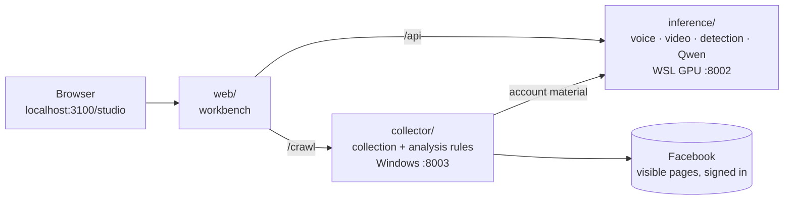

<div align="center">

# Talking Head Lab

**One link shows what a social account exposes, what it could be faked into, and how to tell.**

A local lab for social-media deepfake attack and defence: **collect → social-engineering risk analysis → voice and talking-head generation → authenticity detection**, connected in one workbench.

[中文](README.md) · [English](README.en.md)

[](https://github.com/yxriam/talking-head-lab/actions/workflows/ci.yml)


[](LICENSE)

[Showcase](#showcase) · [What is different](#what-is-different) · [Quick start](#quick-start) · [Project structure](#project-structure) · [Extending](#extending)

</div>

---

## Showcase

| ① Collect | ② Risk analysis | ③ Generate | ④ Detect |
|---|---|---|---|
| Paste a Facebook link; get visible text, images and videos, exportable as ZIP | Classify the account first; only private accounts get warnings, each tied to source text | Reference voice + script → cloned speech; photo + speech → talking portrait | Five research detectors report verdicts, thresholds and suspicious time ranges |

### ① Collect: a page's visible content in 13 seconds

A real run on the [official Donald J. Trump public page](docs/showcase/facebook-trump/EXAMPLE.en.md): **4 scrolls, 13.0 s, 45 text fragments, 11 image entries (4 downloaded), 7 video source links**. Every item keeps its source link, and files that could not be saved are labelled "link only" instead of being reported as successful.


Collected images, videos and audio can be sent straight into cloning, generation or detection without downloading and re-uploading.

### ② Risk analysis: every warning traces back to the source

After collection the system decides whether the account is **private, a business or organisation, or undetermined**. Only private accounts continue to risk analysis. The text is written by a local Qwen3-1.7B model in Chinese and English, and the `[E1]` at the end of a paragraph points to the source line it relies on.

Below, a **synthetic post** (not a real person) goes through the same pipeline; this is the **actual model output**, produced in 6.2 s:

> **Input (post text)**
> My father is not particularly tech savvy, but he can use email! Contact him at dad@family.example.
>
> **Output (what is exposed)**
> The text mentions the father (original wording: “My father”). The address given for the father is dad@family.example. The writer also describes the father as “not particularly tech savvy, able to use email”. `[E1]`
>
> **Output (how it could be used, and what to do)**
> The post containing dad@family.example links the father label to a contact address. Knowing published family details does not establish someone’s identity. Paying on that basis could send money to an unverified recipient; sharing a verification code could compromise the relevant account. Pause payment and disclosure, then verify using the phone number already used to contact the father, not a new number in the message. If the address is not for public contact, remove it or restrict the post. `[E1]`

In the workbench (local test page, synthetic content):


What it does **not** do: no "likelihood of being scammed" score, no personality profile, no inference from looks or likes, no scam scripts. Instructions embedded in a post are treated as data and never executed.

### ③ Generate: one photo plus one voice

Three synthetic portraits, all generated locally by SadTalker. The original image goes to the model as is; the background is not replaced.

<table>
  <tr><th></th><th>Example 1</th><th>Example 2</th><th>Example 3</th></tr>
  <tr><th>Input portrait</th><td><a href="docs/showcase/synthetic-input.png"></a></td><td><a href="docs/showcase/gallery/portrait-02.png"></a></td><td><a href="docs/showcase/gallery/portrait-03.png"></a></td></tr>
  <tr><th>Generated video</th><td></td><td></td><td></td></tr>
  <tr><th>With sound</th><td><a href="docs/showcase/sadtalker-original-demo.mp4">MP4 ①</a></td><td><a href="docs/showcase/gallery/video-02.mp4">MP4 ②</a></td><td><a href="docs/showcase/gallery/video-03.mp4">MP4 ③</a></td></tr>
</table>

Available models: SadTalker, EchoMimic V1, JoyVASA, EchoMimic V3 Flash, and optionally the cloud-hosted Tencent YT HumanActor. Voice cloning uses Chatterbox. [Example sources and downloads](docs/showcase/gallery/EXAMPLES.en.md)

### ④ Detect: the reason, not only a score

Send the video you just generated straight to detection. GenD, NPR, UCF, RECCE and F3-Net each report a verdict, their thresholds and the high-scoring time ranges. When evidence is insufficient the result is "uncertain"; no score is made up.

<details>
<summary>Show the detection screen</summary>


</details>

## What is different

| | Common approach | Talking Head Lab |
|---|---|---|
| **Scope** | Crawlers, face animation tools and detectors are separate projects | Collection, analysis, generation and detection share one workbench; assets move between steps by resource ID |
| **Where data goes** | Uploaded to cloud APIs | Collected data, the analysis model, generation and detection run on your machine by default; cloud options are opt-in |
| **Risk analysis** | A risk score or a persona | Classify first, then analyse; each warning cites source text; no scores, personas or scam scripts |
| **Collection results** | Only what was fetched | Downloaded, link-only and failed items are labelled separately, with source and time |
| **Generation** | Tied to one model | Five portrait models behind one entry point, each with its own framing and duration limits |
| **Detection** | One model says real or fake | Five models plus forensic indicators side by side, with thresholds, time ranges and "uncertain" |
| **Hardware** | Large models or cloud compute | Analysis uses a 1.7B quantised model and returns in seconds; GPU jobs run one at a time |

In short: other projects answer "can it be done"; this one lets you **walk the whole attack chain and the whole defence chain on your own computer**.

## Quick start

**Just look at the interface** (Node.js 22.13+ only, no GPU):

```powershell
git clone https://github.com/yxriam/talking-head-lab.git
cd talking-head-lab/web
npm ci
npm run dev -- --host 127.0.0.1 --port 3100
```

Open <http://localhost:3100/studio>.

**Full setup** (Windows + WSL2 Ubuntu 22.04 + NVIDIA GPU):

```powershell
powershell -ExecutionPolicy Bypass -File scripts\setup.ps1              # once: collector environment + web dependencies
powershell -ExecutionPolicy Bypass -File scripts\deploy-inference.ps1   # after models are installed: sync the inference service
powershell -ExecutionPolicy Bypass -File scripts\start.ps1              # daily: start everything
```

Collection and rule-based analysis only need the Windows part. Without the local model, account analysis falls back to the rule draft and says why. Model installation, cloud options and troubleshooting are in the [setup guide](docs/guides/SETUP.en.md).

## Project structure

How each feature maps to code:

| Feature | Interface | API | Core code | Runs on |
|---|---|---|---|---|
| ① Collect | `web/app/studio/CrawlPanel.tsx` | `/crawl/jobs` | `collector/facebook.py`, `collector/crawl_server.py` | Windows · 8003 |
| ② Risk analysis | `web/app/studio/AccountRiskReport.tsx` | `/crawl/jobs/{id}/analyze` | `collector/account_risk.py` → `account_story.py` → `account_llm.py` → `inference/local_account_model.py` | Windows rules + WSL model |
| ③ Generate | `web/app/studio/Studio.tsx` | `/api/jobs` | `inference/server.py`, `generate.py`, `video_profiles.py`, `tokenhub.py` | WSL GPU · 8002 |
| ④ Detect | `web/app/studio/Studio.tsx` | `/api/jobs` | `inference/detect.py`, `truthscan.py` | WSL GPU · 8002 |



```text
talking-head-lab/
├─ web/          workbench front end (React 19 + vinext)
├─ collector/    ① collection + ② analysis rules and bridge (Windows service)
│  └─ eval/      model evaluation scripts and frozen cases for the analysis chain
├─ inference/    ③ generation + ④ detection + local Qwen (WSL GPU service)
│  ├─ config/ deploy/ install/     configuration templates, deployment sync, model installers
│  └─ verify/ benchmark/           install checks, model comparison, threshold calibration
├─ scripts/      setup / start / stop / deploy-inference / test
├─ tests/        program tests (no GPU needed)
├─ docs/         guides, feature specs, showcase assets, change records
└─ legacy/       early experiment scripts, kept for reference
```

## Extending

Each feature is one line from interface to API to code to tests. Change a feature and you only need to read that line.

| I want to… | Start here | Verify with |
|---|---|---|
| **Collect more fields or support another platform** | `collect()` in `collector/facebook.py`; for a new platform add a collector with the same output shape and wire it into `crawl_server.py` | `tests/test_crawl.py` |
| **Add a kind of risk rule** | `RULES` in `collector/account_risk.py`; one rule = pattern + risk statement + protective action | `tests/test_account_risk.py`, `test_account_scope.py` |
| **Change the analysis wording or swap the model** | Prompt and model path in `inference/local_account_model.py` | `tests/test_account_llm.py` plus a real-model run from `collector/eval/` |
| **Add a portrait or voice model** | Register it in `inference/video_profiles.py` → call it from `generate.py` → report readiness in `server.py` → add the option in the front end | `tests/test_video_profiles.py`, `test_server.py` |
| **Add a detection method** | `inference/detect.py`; return the shared method-result shape and the front end displays it | `tests/test_detect_thresholds.py` |
| **Change the interface** | `web/app/studio/`; API types live in `api.ts` and `crawl-api.ts` | `cd web && npm run build` |

```powershell
powershell -ExecutionPolicy Bypass -File scripts\test.ps1   # all program tests + front-end build
```

Data shapes, API contracts and step-by-step extension notes for each module are in the [development guide](docs/guides/DEVELOPMENT.en.md). Commit conventions are in [CONTRIBUTING.md](CONTRIBUTING.md). If you work with Codex, Claude Code or Cursor, start from [AGENTS.md](AGENTS.md).

## Documentation

| Topic | Where |
|---|---|
| Installation, start-up, cloud options, troubleshooting | [Setup guide](docs/guides/SETUP.en.md) |
| How to change and test each module | [Development guide](docs/guides/DEVELOPMENT.en.md) |
| What works today and what is still open | [Project status](docs/STATUS.md) |
| Where the showcase assets come from | [Provenance](docs/showcase/PROVENANCE.md) |

## Responsible use

This project is for anti-scam education and security research. Collect only visible content you are allowed to access. Clone or animate only photos and voices you are authorised to use, and label generated media as AI-made. The portraits and voices shown here are synthetic, and the account-analysis example is fictional. See [SECURITY.md](SECURITY.md).

## License

[MIT](LICENSE). Models and weights keep their original licences.
