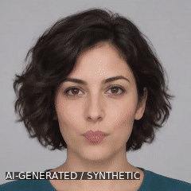
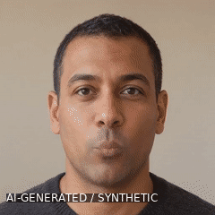
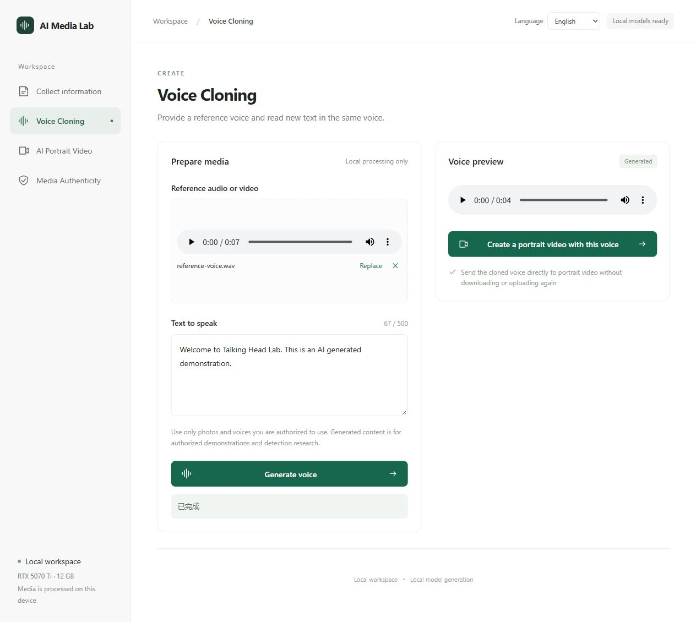
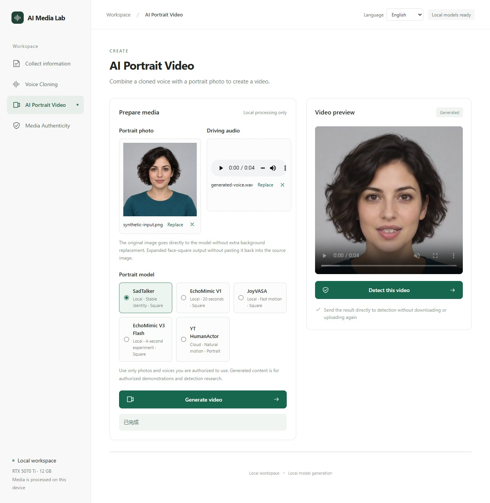
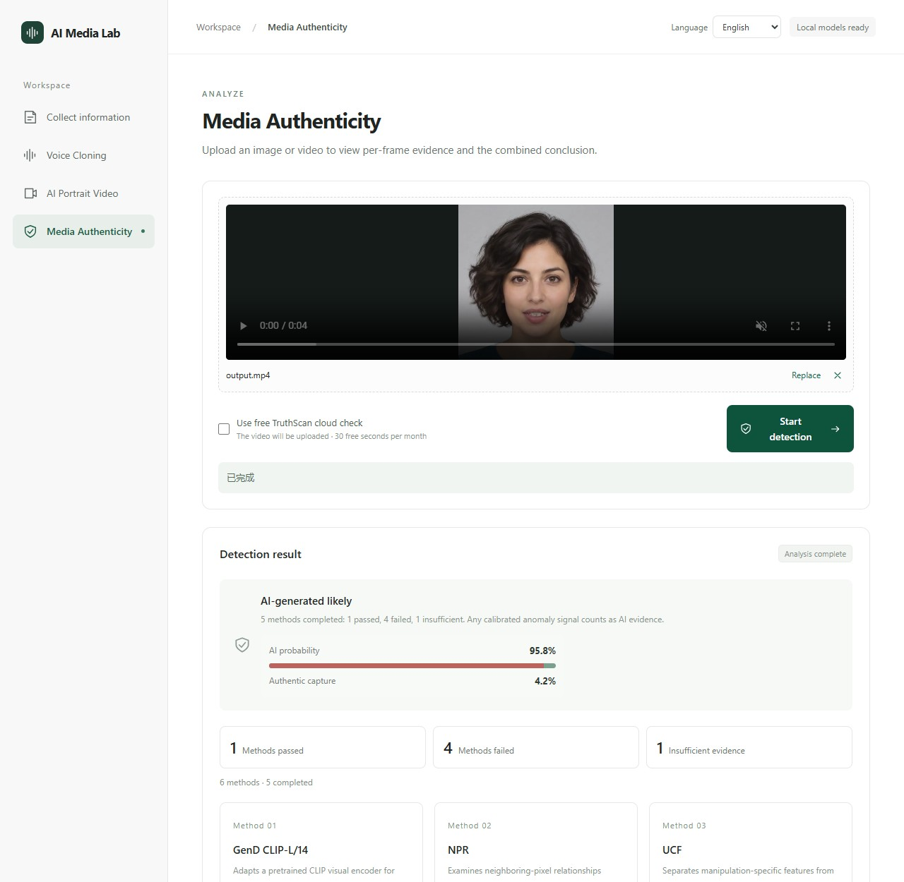

# Talking Head Lab

[中文](README.md) · [English](README.en.md)

Collect Facebook content, create speech and talking-head videos, and inspect media-authenticity evidence.

## What you can do

| Feature | You provide | You get |
|---|---|---|
| Facebook collection | A profile, post or video URL | Visible text, sources, downloadable media and a ZIP |
| Voice cloning | A reference voice + new text | New speech in the reference voice |
| Portrait video | A photo + driving audio | A talking-head video generated directly from the original photo |
| Authenticity detection | An image or video | Method scores, sampled frames and supporting evidence |

Use each feature independently, or pass generated speech to video and video to detection.

## See the results, then try the inputs

Three different synthetic people and synthetic speech, with videos **actually generated by SadTalker**. Click a portrait to download it. GIFs are silent; MP4s include sound.

<table>
  <tr><th></th><th>Example 1</th><th>Example 2</th><th>Example 3</th></tr>
  <tr><th>Input photo</th><td><a href="docs/showcase/synthetic-input.png"></a></td><td><a href="docs/showcase/gallery/portrait-02.png"></a></td><td><a href="docs/showcase/gallery/portrait-03.png"></a></td></tr>
  <tr><th>Actual video</th><td></td><td></td><td></td></tr>
  <tr><th>Play with sound</th><td><a href="docs/showcase/sadtalker-original-demo.mp4">MP4 ①</a></td><td><a href="docs/showcase/gallery/video-02.mp4">MP4 ②</a></td><td><a href="docs/showcase/gallery/video-03.mp4">MP4 ③</a></td></tr>
</table>

[Download driving audio](docs/showcase/generated-voice.wav) · [Hear the reference voice](docs/showcase/reference-voice.wav) · [Example details and sources](docs/showcase/gallery/EXAMPLES.en.md)

**Live Facebook example:** [Trump's official page](docs/showcase/facebook-trump/EXAMPLE.en.md), with 45 text fragments and 4 downloaded images over 4 scrolls. Video entries are source links only. This example performs collection without personal-risk analysis.

<details>
<summary>Expand to see the workbench</summary>






</details>

## Quick start

### Browse the interface first (no GPU needed)

Requires Node.js 22.13+. Run:

```powershell
git clone https://github.com/yxriam/talking-head-lab.git
Set-Location talking-head-lab/facebook-scam/video-forensics-web
npm ci
npm run dev -- --host 127.0.0.1 --port 3100
```

Open **http://localhost:3100/studio**. This starts the interface; generation and detection require backend models.

### Generate your first video

Prepare the Windows + WSL2 model environment using the [setup guide](docs/guides/SETUP.en.md). With an existing installation, start from the project root:

```powershell
powershell -ExecutionPolicy Bypass -File .\local-media\start-local.ps1
```

Download any example portrait and the driving audio → open “AI Portrait Video” → upload both files → choose SadTalker → generate. Trying video requires neither Facebook collection nor a prior voice-cloning run.

<details>
<summary>More workflows, model choices and common questions</summary>

- Speech: reference audio/video + text → generate speech → send it to portrait video.
- Detection: upload media or reuse a generated video → inspect methods and sampled frames; scores are model evidence.
- Facebook: log in manually first. For public pages, use the [collection-only workflow](docs/showcase/facebook-trump/EXAMPLE.en.md). Account-safety suggestions currently apply only to personal accounts; automatic gating still awaits acceptance.
- Video options include SadTalker, EchoMimic, JoyVASA and Tencent YT HumanActor, depending on deployment readiness.
- [Installation, startup, cloud configuration and limits](docs/guides/SETUP.en.md) · [Detailed startup troubleshooting (Chinese)](网站启动说明.md) · [Asset provenance](docs/showcase/PROVENANCE.md)

</details>

## Make changes

[Project structure, code map and development](docs/guides/DEVELOPMENT.en.md) · [Contributor rules](AGENTS.md) · [Current project state](PROJECT.md)
