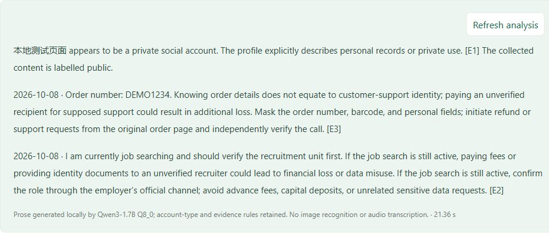

# Talking Head Lab

**Collect visible information, generate a voice and a portrait video, then inspect media-authenticity evidence.**

[简体中文](README.md) · [English](README.en.md)

An AI media workbench maintained on Windows + WSL2. It combines Facebook collection and account-safety analysis, voice cloning, photo-driven video, and media-authenticity detection. The four modules work independently or pass media between stages using resource IDs.

## Features and results

### A real generated example

<table>
  <tr><th>① Synthetic original image</th><th>② Video generated directly from that image</th></tr>
  <tr>
    <td></td>
    <td></td>
  </tr>
</table>

The input person was created with imagegen, and the reference voice with Windows speech synthesis. The project uses the actual **Chatterbox** output and passes the original image directly to **SadTalker**, with no added background-replacement stage. The GIF comes from the same **512×512, 4.736-second** video. Spoken text:

> Welcome to Talking Head Lab. This is an AI generated demonstration.

[Play or download the MP4 with sound](docs/showcase/sadtalker-original-demo.mp4) · [Synthetic reference voice WAV](docs/showcase/reference-voice.wav) · [Chatterbox output WAV](docs/showcase/generated-voice.wav) · [Asset provenance and run evidence](docs/showcase/PROVENANCE.md)

The generation example uses a synthetic person and reference voice; voice, video, and detection are actual runs. Facebook screenshots below use a **real collection from Donald J. Trump's official page**. The account-safety prose layout still uses an existing synthetic test record, with no new account-analysis inference.

### What each module does

| Module | Input | Output | Next step |
|---|---|---|---|
| **Collection and account analysis** | An accessible Facebook profile, post, or video URL, with a manually authenticated browser session | Visible original text, source links, downloadable media, a ZIP, and text-supported safety suggestions | Pass downloaded photos, audio, or video to generation or detection |
| **Voice cloning** | Clear reference audio or a video containing speech, plus new text | Chatterbox-generated speech for preview and download | Send the voice directly to portrait video using its resource ID |
| **AI portrait video** | A front-facing portrait and driving audio | Video driven directly from the original image | Preview, download, or directly detect the result |
| **Media authenticity** | An image, an uploaded video, or a video generated in the workbench | Method results, scores, sampled frames and times, and pass/fail/insufficient-evidence counts | Compare the specific time windows and method explanations |

### 1. Collection and account-safety analysis


**Real account example:** [Donald J. Trump's Facebook page](https://www.facebook.com/DonaldTrump/). On 2026-10-09 at 06:41 UTC, the existing collector completed 4 scrolls in **13.0 seconds**, returning **45 visible text fragments, 11 image entries and 7 video entries**. It downloaded **4 images and 0 video/audio files**. Fragments include profile fields, interface text and some comments; they are not 45 posts.


Only 4 profile-text excerpts and workbench screenshots are published. Commenter data, original image files and browser sessions remain local. The 7 video entries are source links only, including different links to the same Reel. Publication dates were not extracted and remain missing. The real workbench and collector API loaded a public excerpt of the completed run for screenshots; capturing them performed no new collection or inference. [Example details and video-link interface](docs/showcase/facebook-trump/EXAMPLE.en.md) · [Sources, timestamps, counts and file SHA256 values](docs/showcase/facebook-trump/collection-summary.json).

The visible introduction and purpose field identify an official political public page, so this example performs **collection only, with no personal-risk analysis**. It directly calls the sole existing collector and omits account analysis; that describes this example's execution, not completion of the automatic gate described below.

Choose 4, 8, or 20 scrolls, preview visible text, images, videos, and audio, and export a ZIP. Login or verification pages require manual user action. For an account already identified as personal, rules and local Qwen organize traceable text into quoted relationships and contact information, and corresponding verification actions. This is text analysis: it does not identify faces, transcribe audio, or calculate a person's probability of being scammed.

**Current version boundary:** the latest requirement is to classify personal, business/institutional, or undetermined purpose first, then analyze only personal accounts. The new gate and generalization implementation currently exists only in the original workspace and has not been synchronized to this published version or the running service. This GitHub version has not completed automatic gating: manually confirm personal purpose before analysis and skip business or undetermined material. Generalized prose still has known failures involving repetition, inaccurate quotations, and omitted safeguards.



Quotes retain their original language. Switching Chinese/English changes the analysis text and ZIP text report. Evidence pairs, time propagation, and impact explanations for major prevention conflicts remain a [pending specification](docs/specs/account-warning-conflicts.md); this interface example does not establish acceptance of that new specification.

### 2. A reference voice → new speech


Reference inputs can be audio or video with an audio track. The pipeline extracts the track and uses at most its first 20 seconds; text is limited to 500 characters. Preview or download the output, or choose “Create a portrait video with this voice.” The synthetic system reference is approximately 7.3 seconds; the project output is **4.68 seconds**, and the job reports **38.1 seconds** of generation time. These timings describe this demonstration environment.

### 3. A photo and speech → a portrait video


The original image and driving audio go directly to the selected video model. There is no added setting selection, background generation, or portrait compositing. Required native cropping, resizing, alignment, and output composition follow the selected model; account-text Qwen remains independent.

| Model option | Execution | Current API duration limit | Output |
|---|---|---|---|
| SadTalker | Local GPU | Up to 60 seconds | Expanded face crop, square video |
| EchoMimic V1 | Local GPU | Up to 20 seconds | Native square video |
| JoyVASA | Local GPU | Up to 60 seconds | Native square video |
| EchoMimic V3 Flash | Local GPU | Experimental clips up to 4 seconds | Native short video |
| YT HumanActor | Tencent TokenHub + COS | 2–60 seconds | Portrait input, native cloud output dimensions |

The new example runs **SadTalker**. Its job reports **61.9 seconds**, with no background-preparation stage. Other choices expose their configured readiness; they were not regenerated in this task. The Tencent model ID is `yt-video-humanactor`; configuration appears in the deployment section.

### 4. A video → evidence from several methods


The detector includes GenD, NPR, UCF, RECCE, F3-Net, and photo-driven temporal staticness. Spectrum, optical-flow, and continuity measurements provide supporting forensic evidence. In the video domain, NPR displays insufficient evidence and is excluded from the vote. Methods expose their explanations and applicable higher/lower-score time windows.

The demonstration video returns **AI-generated likely**, a displayed aggregate score of **95.8%**, and **1 passed, 4 failed, 1 insufficient**. The job reports **24.1 seconds**. The [original JSON report](docs/showcase/detection-original-report.json) preserves the actual values. Scores follow the current models and local thresholds for this sample; unfamiliar videos require consideration of method disagreement, sampling, and provenance.

## Deployment

### Requirements and two startup paths

| Component | Environment |
|---|---|
| Interface preview | Node.js **>=22.13.0**, as declared in [package.json](facebook-scam/video-forensics-web/package.json) |
| Windows collection | Python 3.10+, Playwright; existing Chrome/Edge can be reused, otherwise install Chromium |
| Full local inference | Windows + WSL2 / Ubuntu 22.04, NVIDIA GPU, separate model environments and weights |
| Maintained directories | Models: `/opt/media-models`; backend runtime: `/opt/media-app/local-media` |
| Optional cloud features | TokenHub + COS; TruthScan is configured separately |

This task verified `npm ci`, the frontend build in the publishing checkout, and the synthetic-media runs above. A full GPU installation on a fresh machine was not repeated. The current installers contain fixed paths, Python 3.10 directory assumptions, and CUDA compilation settings that must be checked against the target device.

### A. Start with an interface preview

Clone into a new directory and start the frontend:

```powershell
git clone https://github.com/yxriam/talking-head-lab.git
Set-Location talking-head-lab/facebook-scam/video-forensics-web
npm ci
npm run dev -- --host 127.0.0.1 --port 3100
```

Open **http://localhost:3100/studio**. Without the backend and models, the four interfaces remain visible and generation/detection show unavailable capabilities. Continue below to enable local model execution.

### B. Configure the full Windows + WSL environment

**1. Check paths.** The Linux installation/synchronization scripts still reference `D:/project/cv` and `D:/project/NZ/cv`. A fresh machine can use the layout below. For another checkout location, first update corresponding paths in `prepare-linux.ps1`, `run-linux.ps1`, `activate-api.sh`, `sync-runtime.sh`, and installation scripts. The maintainer's publishing checkout is currently `D:/project/facebook/talking-head-lab`; runtime updates must likewise point to the actual source checkout.

<details>
<summary>Fixed-path example for a fresh machine, only when the directories do not already exist</summary>

```powershell
New-Item -ItemType Directory -Path D:\project\NZ -Force
git clone https://github.com/yxriam/talking-head-lab.git D:\project\NZ\cv
New-Item -ItemType Junction -Path D:\project\cv -Target D:\project\NZ\cv
Set-Location D:\project\cv
```

</details>

**2. Install Windows collector and frontend dependencies.** From the project root:

```powershell
py -3 -m venv local-media\.venv
local-media\.venv\Scripts\python.exe -m pip install -r local-media\requirements-crawl.txt
local-media\.venv\Scripts\python.exe -m playwright install chromium
Set-Location facebook-scam/video-forensics-web
npm ci
npm run build
Set-Location ../..
```

Finish large model jobs before building on a memory-constrained system. This task's build passed with native build threads limited using `$env:RAYON_NUM_THREADS='2'`. The collector selects installed Chrome/Edge, or falls back to Playwright Chromium.

**3. Prepare WSL and the models.** Install Ubuntu, complete its first-run user setup, and check GPU access:

```powershell
wsl --install -d Ubuntu-22.04
wsl -d Ubuntu-22.04 -- nvidia-smi
powershell -ExecutionPolicy Bypass -File .\local-media\prepare-linux.ps1
```

Below is the dependency order for the existing installers. Model downloads are large; run each step separately and check its logs. CUDA architecture `120` and other settings in `install-scene-llm.sh` must match the device.

<details>
<summary>Local model and backend service installation order</summary>

```powershell
powershell -ExecutionPolicy Bypass -File .\local-media\run-linux.ps1 -Task setup-models
powershell -ExecutionPolicy Bypass -File .\local-media\run-linux.ps1 -Task install-generators
powershell -ExecutionPolicy Bypass -File .\local-media\run-linux.ps1 -Task install-echomimic
powershell -ExecutionPolicy Bypass -File .\local-media\run-linux.ps1 -Task install-detectors
powershell -ExecutionPolicy Bypass -File .\local-media\run-linux.ps1 -Task install-npr
powershell -ExecutionPolicy Bypass -File .\local-media\run-linux.ps1 -Task install-gend
wsl -d Ubuntu-22.04 -u root -- bash /mnt/d/project/cv/local-media/install-scene-llm.sh
wsl -d Ubuntu-22.04 -u root -- mkdir -p /opt/media-app/local-media
wsl -d Ubuntu-22.04 -u root -- cp /mnt/d/project/cv/local-media/patch_echomimic_v3_memory.py /opt/media-app/local-media/
wsl -d Ubuntu-22.04 -u root -- bash /mnt/d/project/cv/local-media/install-sota-generators.sh
powershell -ExecutionPolicy Bypass -File .\local-media\run-linux.ps1 -Task activate-api
```

`sync-runtime.sh` currently checks its listed model directories, so this full startup path requires those directories first. Weight readiness, model acceptance, and service verification are separate stages. The existing [detailed installation/startup guide in Chinese](网站启动说明.md) covers logs, network repairs, and shutdown.

</details>

**4. Daily startup and health checks.** Once model environments and the service are prepared, run from the project root:

```powershell
powershell -ExecutionPolicy Bypass -File .\local-media\start-local.ps1
curl.exe http://localhost:3100/api/health
curl.exe http://127.0.0.1:8003/crawl/health
```

The model health endpoint should return `status: ok`; each capability's `ready` describes its current configuration. The workbench is at `http://localhost:3100/studio`. Windows provides collection on 8003, WSL provides inference on 8002, and the frontend proxies both. Closing the browser leaves background services running; the [shutdown section](网站启动说明.md#3-怎么正确停止) documents how to stop them completely.

### Optional: Tencent video generation and cloud cross-checks

Tencent TokenHub uses `yt-video-humanactor`. Put the API key and COS SecretId, SecretKey, region, and bucket in Ubuntu's `/etc/media-app/tokenhub.env`, loaded through the existing systemd configuration script. The adapter uploads both inputs to COS, submits short-lived signed `image_url` / `audio_url` links, polls the job, downloads the result, and attempts to clean up temporary objects.

TruthScan uses `/etc/media-app/truthscan.env`. Enabling its checkbox uploads the video and uses account quota. It was disabled for this demonstration, which ran only local methods. Configuration details are in the [backend TokenHub guide](local-media/README.md#tokenhub-人像驱动) and [TruthScan guide](local-media/README.md#truthscan-免费云端复核). Real credentials, sessions, and secrets stay on the local machine.

## Usage

1. **Collect**: open “Collect information” → log in manually → paste an accessible URL → collect → preview sources and media → confirm purpose and inspect suggestions only for a personal account, skipping risk analysis otherwise → export a ZIP.
2. **Voice**: upload clear, authorized reference speech → enter new text → generate and listen → choose “Create a portrait video with this voice.”
3. **Video**: select a clear front-facing portrait → choose audio and a model → generate → preview/download → choose “Detect this video.”
4. **Detect**: reuse the generated video or upload an independent image/video → decide whether to enable the external cross-check → review the summary, explanations, frames, and times.

Start from any module. Voice/video handoffs reuse resource IDs without repeated downloads and uploads. Directly uploaded driving audio is used for driving, without automatic transcription or a background stage. The current API file limit is 500 MB, and GPU work is serialized. Uploaded and generated files remain in the running service's `data/`, with task cleanup managed by the user.

## Project structure and code map

```text
talking-head-lab/
├─ README.md / README.en.md                 Chinese / English entry points
├─ facebook-scam/
│  ├─ crawler/facebook.py                   Sole online collector
│  └─ video-forensics-web/
│     ├─ app/studio/                        Four modules, styles, frontend APIs
│     ├─ build/sites-vite-plugin.ts         Required Vite plugin source
│     └─ tests/                             Existing frontend checks
├─ local-media/
│  ├─ crawl_server.py / server.py            Windows collection / WSL media API
│  ├─ account_risk.py / account_story.py      Text evidence rules and prose
│  ├─ account_llm.py / local_account_model.py Local bridge and inference
│  ├─ generate.py / video_profiles.py        Model subprocesses, layout, duration
│  ├─ local_scene.py / prepare_scene.py      Historical background experiments, outside video flow
│  ├─ detect.py                             Detection and supporting forensics
│  ├─ tokenhub.py / truthscan.py             Optional external adapters
│  ├─ detector-runtime/                     Detector registration installer source
│  └─ test_*.py / *.sh / *.ps1               Tests, install, startup, synchronization
├─ docs/showcase/                           Public synthetic demos and provenance
├─ docs/specs/ / docs/change-records/        Contracts, changes, verification, rollback
└─ AGENTS.md / CLAUDE.md / .cursor/rules/    Shared collaboration rules and entry points
```

Other root scripts and research documents retain their historical provenance. Maintain the current workbench under `app/studio/`. Model weights, virtual environments, personal media, collected data, and real secrets are excluded from source control; the explicitly labeled synthetic showcase assets support this README.

## Further development

### Where to make a change

| Change | Entry points and checks |
|---|---|
| UI, layout, frontend behavior | `Studio.tsx`, `CrawlPanel.tsx`, `studio.css`, `crawl.css`, `api.ts`; frontend build and behavior checks |
| Collection fields | `crawler/facebook.py` → `crawl_server.py` → account rules/bridge/output; retain sources and time metadata, run collection tests |
| Account prompts or prose | `account_risk.py` → `account_story.py` → `account_llm.py` → `server.py /account-analysis` → `local_account_model.py`; program tests and actual model acceptance |
| Another video model | `video_profiles.py`, `generate.py`, backend capabilities/queue, frontend choices; specify layout, duration, and failures |
| Detection method | `detect.py`, report fields, frontend presentation; retain actual thresholds, sampled times, and insufficient-evidence states |

### Verify, synchronize, and roll back

Read [AGENTS.md](AGENTS.md) and [PROJECT.md](PROJECT.md), then use the [maintenance workflow](docs/WORKFLOW.md) to freeze a task specification, inspect the actual diff, run directly relevant checks, and commit one accepted task at a time.

```powershell
local-media\.venv\Scripts\python.exe -m unittest discover -s local-media -p test_account_llm.py -v
local-media\.venv\Scripts\python.exe -m unittest discover -s local-media -p test_server.py -v
Set-Location facebook-scam/video-forensics-web
npm run build
```

Add account-rule/prose, collection, or model checks according to scope. Prompt changes require frozen cases and real model outputs; program tests do not replace semantic acceptance.

Backend deployment uses SHA256 synchronization through `sync-runtime.sh`, followed by restart and service verification. Its source path must point to the actual maintained checkout. Source commits, GitHub publication, and runtime deployment are separate stages.

```powershell
wsl -d Ubuntu-22.04 -u root -- bash /mnt/d/project/cv/local-media/sync-runtime.sh
wsl -d Ubuntu-22.04 -u root -- systemctl restart local-media.service
curl.exe http://localhost:3100/api/health
```

For a shared change, run `git revert <actual commit>`, verify it, and normally `git push origin main`. The [showcase change record](docs/change-records/2026-10-09-readme-showcase/记录.md) preserves this task's real inputs, timings, failures and fixes, checks, and rollback.
