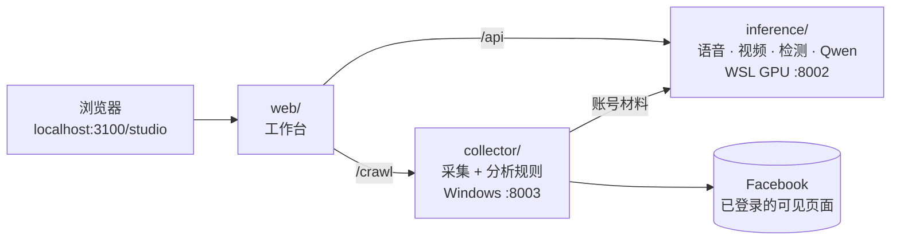

<div align="center">

# Talking Head Lab · AI 媒体实验室

**一条链接，看清一个社交账号暴露了什么、能被伪造成什么、又该怎么识别。**

本地运行的社媒深伪攻防实验台：**爬取 → 社工风险分析 → 语音与人像生成 → 真伪检测**，四步在同一个工作台里打通。

[中文](README.md) · [English](README.en.md)

[](https://github.com/yxriam/talking-head-lab/actions/workflows/ci.yml)


[](LICENSE)

[效果展示](#效果展示) · [为什么不一样](#为什么不一样) · [快速开始](#快速开始) · [项目结构](#项目结构) · [二次开发](#二次开发)

</div>

---

## 效果展示

| ① 爬取 | ② 社工分析 | ③ 生成 | ④ 检测 |
|---|---|---|---|
| 粘贴 Facebook 链接，取回可见文字、图片、视频并打包 ZIP | 先判断账号类型，只对私人账号给出有原文依据的防范提醒 | 参考声音 + 台词 → 克隆语音；照片 + 语音 → 会说话的人像 | 5 个学术检测模型逐项给出结论、阈值和可疑时间段 |

### ① 爬取：13 秒取回一个主页的可见内容

真实采集 [Donald J. Trump 官方公共主页](docs/showcase/facebook-trump/EXAMPLE.md)：**4 次滚动、13.0 秒，45 条文字片段、11 个图片条目（4 张已下载）、7 个视频来源链接**。每条内容都带来源链接，拿不到的文件如实标成“仅链接”，不伪造成功。


采到的图片、视频、音频可以一键带入后面的克隆、生成和检测，不用下载再上传。

### ② 社工分析：每一句提醒都能追到原文

采集完成后，系统先判断这是**私人账号、企业/机构，还是无法确定**，只有私人账号才进入风险分析。分析由本地 Qwen3-1.7B 生成，中英双语，每段末尾的 `[E1]` 指向它依据的那条原文。

下面是一条**合成帖子**（非真实人物）经过同一条分析链路得到的**真实模型输出**，耗时 6.2 秒：

> **输入（帖子原文）**
> My father is not particularly tech savvy, but he can use email! Contact him at dad@family.example.
>
> **输出（暴露了什么）**
> 文字提到父亲（原文“My father”）。文中给出的父亲联系邮箱是 dad@family.example。帖子还说父亲“不太熟悉技术、能使用邮箱”。 `[E1]`
>
> **输出（会怎样被利用、该怎么做）**
> 含 dad@family.example 的帖子把“父亲”称呼与联系地址放在了一起，但知道这些公开信息，不代表联系者真的认识家人。如果只因对方知道家事就转账，可能把钱付给未核实的收款人；如果交出验证码，相关账户可能失去控制。遇到这类请求，先停止付款和资料提交，用平时联系父亲的电话核实，不用消息里提供的新号码。若邮箱不用于公开联系，移除地址或限制该帖可见范围。 `[E1]`

工作台里的样子（本地测试页面，内容为合成）：


它**不会**做的事：不算“受骗概率”，不给人物画像，不从长相或点赞推断性格，不输出诈骗话术；帖子里夹带的指令只当作数据，不会被执行。

### ③ 生成：一张照片 + 一段声音

三组合成人像，全部由 SadTalker 在本机实际生成，原图直接进入模型，不换背景。

<table>
  <tr><th></th><th>样例 1</th><th>样例 2</th><th>样例 3</th></tr>
  <tr><th>输入原图</th><td><a href="docs/showcase/synthetic-input.png"></a></td><td><a href="docs/showcase/gallery/portrait-02.png"></a></td><td><a href="docs/showcase/gallery/portrait-03.png"></a></td></tr>
  <tr><th>生成视频</th><td></td><td></td><td></td></tr>
  <tr><th>带声播放</th><td><a href="docs/showcase/sadtalker-original-demo.mp4">MP4 ①</a></td><td><a href="docs/showcase/gallery/video-02.mp4">MP4 ②</a></td><td><a href="docs/showcase/gallery/video-03.mp4">MP4 ③</a></td></tr>
</table>

可选模型：SadTalker、EchoMimic V1、JoyVASA、EchoMimic V3 Flash，以及可选的云端腾讯 YT HumanActor。语音克隆使用 Chatterbox。[样例来源与素材下载](docs/showcase/gallery/EXAMPLES.md)

### ④ 检测：告诉你“为什么”，而不只是一个分数

把刚生成的视频直接送去检测：GenD、NPR、UCF、RECCE、F3-Net 五个模型各自给出结论、阈值和高分时间段；证据不够时返回“不确定”，不编造分数。

<details>
<summary>展开查看检测界面</summary>


</details>

## 为什么不一样

| | 常见做法 | Talking Head Lab |
|---|---|---|
| **覆盖范围** | 爬虫、换脸工具、检测器各是各的项目 | 采集、分析、生成、检测在一个工作台里，素材按资源 ID 直接流转 |
| **数据去向** | 上传到云端 API | 采集数据、分析模型、生成与检测默认都在本机；云端接口需要你主动勾选 |
| **风险分析** | 给一个风险分数或人物画像 | 先分类、后分析；每句提醒附原文编号，不打分、不画像、不输出话术 |
| **采集结果** | 只保留抓到的 | 抓到的、只拿到链接的、失败的分别标注，来源和时间可追溯 |
| **生成** | 绑定一个模型 | 5 个人像模型同一入口横向对比，按各自能力选择构图与时长 |
| **检测** | 单模型输出真/假 | 5 个模型加取证指标并列，给出阈值、时间段和“不确定” |
| **硬件** | 依赖大模型或云算力 | 分析用 1.7B 量化模型，几秒到二十秒出结果；GPU 任务排队逐个执行 |

一句话：别的项目回答“能不能做到”，这个项目让你**在自己电脑上把攻击链和防御链完整走一遍**。

## 快速开始

**只想看界面**（只需要 Node.js 22.13+，不需要 GPU）：

```powershell
git clone https://github.com/yxriam/talking-head-lab.git
cd talking-head-lab/web
npm ci
npm run dev -- --host 127.0.0.1 --port 3100
```

打开 <http://localhost:3100/studio>。

**完整运行**（Windows + WSL2 Ubuntu 22.04 + NVIDIA GPU）：

```powershell
powershell -ExecutionPolicy Bypass -File scripts\setup.ps1              # 一次：采集环境 + 前端依赖
powershell -ExecutionPolicy Bypass -File scripts\deploy-inference.ps1   # 模型装好后：同步推理服务
powershell -ExecutionPolicy Bypass -File scripts\start.ps1              # 每天：一键启动
```

采集和规则分析只需要前两步里的 Windows 部分；没有本地模型时，账号分析会退回规则草稿并注明原因。模型安装、云端接口配置和排障见 [部署指南](docs/guides/SETUP.md)。

## 项目结构

先看功能怎么落到代码上：

| 功能 | 界面 | 接口 | 核心代码 | 运行位置 |
|---|---|---|---|---|
| ① 爬取 | `web/app/studio/CrawlPanel.tsx` | `/crawl/jobs` | `collector/facebook.py`、`collector/crawl_server.py` | Windows · 8003 |
| ② 社工分析 | `web/app/studio/AccountRiskReport.tsx` | `/crawl/jobs/{id}/analyze` | `collector/account_risk.py` → `account_story.py` → `account_llm.py` → `inference/local_account_model.py` | Windows 规则 + WSL 模型 |
| ③ 生成 | `web/app/studio/Studio.tsx` | `/api/jobs` | `inference/server.py`、`generate.py`、`video_profiles.py`、`tokenhub.py` | WSL GPU · 8002 |
| ④ 检测 | `web/app/studio/Studio.tsx` | `/api/jobs` | `inference/detect.py`、`truthscan.py` | WSL GPU · 8002 |



```text
talking-head-lab/
├─ web/          工作台前端（React 19 + vinext）
├─ collector/    ① 爬取 + ② 分析规则与桥接（Windows 服务）
│  └─ eval/      分析链路的模型评测脚本与冻结用例
├─ inference/    ③ 生成 + ④ 检测 + 本地 Qwen（WSL GPU 服务）
│  ├─ config/ deploy/ install/     配置模板、同步部署、模型安装
│  └─ verify/ benchmark/           安装验证、模型对比与阈值校准
├─ scripts/      setup / start / stop / deploy-inference / test
├─ tests/        程序测试（不需要 GPU）
├─ docs/         指南、功能规格、展示素材、变更记录
└─ legacy/       早期实验脚本，仅供追溯
```

## 二次开发

每个功能都是“界面 → 接口 → 代码 → 测试”一条线，改哪个功能就只看那一条。

| 我想… | 从这里开始 | 改完验证 |
|---|---|---|
| **采集更多字段，或支持新平台** | `collector/facebook.py` 的 `collect()`；新平台照它的输出结构新增一个采集器，在 `crawl_server.py` 接入 | `tests/test_crawl.py` |
| **增加一类风险规则** | `collector/account_risk.py` 的 `RULES`，一条规则 = 匹配模式 + 风险说明 + 防范动作 | `tests/test_account_risk.py`、`test_account_scope.py` |
| **调整分析措辞或换模型** | `inference/local_account_model.py` 的提示词与模型路径 | `tests/test_account_llm.py` + `collector/eval/` 真实模型评测 |
| **接入新的人像或语音模型** | `inference/video_profiles.py` 登记能力 → `generate.py` 加调用 → `server.py` 报告就绪状态 → 前端模型选项 | `tests/test_video_profiles.py`、`test_server.py` |
| **接入新的检测方法** | `inference/detect.py`，返回统一的方法结果结构，前端自动展示 | `tests/test_detect_thresholds.py` |
| **改界面** | `web/app/studio/`，接口类型在 `api.ts` 和 `crawl-api.ts` | `cd web && npm run build` |

```powershell
powershell -ExecutionPolicy Bypass -File scripts\test.ps1   # 全部程序测试 + 前端构建
```

每个模块的数据结构、接口约定和扩展步骤见 [开发指南](docs/guides/DEVELOPMENT.md)；提交规范见 [CONTRIBUTING.md](CONTRIBUTING.md)。使用 Codex、Claude Code 或 Cursor 协作时，入口是 [AGENTS.md](AGENTS.md)。

## 文档

| 想了解 | 看这里 |
|---|---|
| 安装、启动、云端接口、排障 | [部署指南](docs/guides/SETUP.md) |
| 各模块怎么改、怎么测 | [开发指南](docs/guides/DEVELOPMENT.md) |
| 现在做到哪了、还有什么没做 | [项目状态](docs/STATUS.md) |
| 展示素材从哪来 | [素材来源](docs/showcase/PROVENANCE.md) |

## 负责任地使用

本项目用于反诈教学与安全研究。只采集你有权访问的可见内容；只对已获授权的照片和声音做克隆与生成；生成结果请明确标注为 AI 合成。展示用的人像与声音均为合成素材，账号分析示例为虚构内容。详见 [SECURITY.md](SECURITY.md)。

## License

[MIT](LICENSE)。各模型与权重遵循其原始许可。
