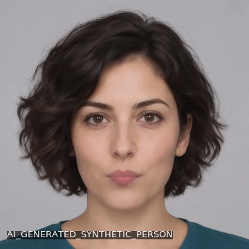
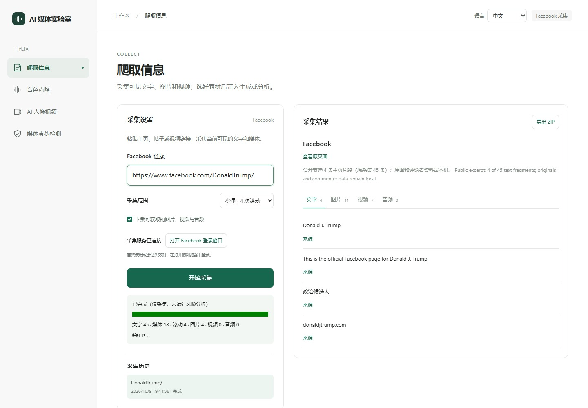
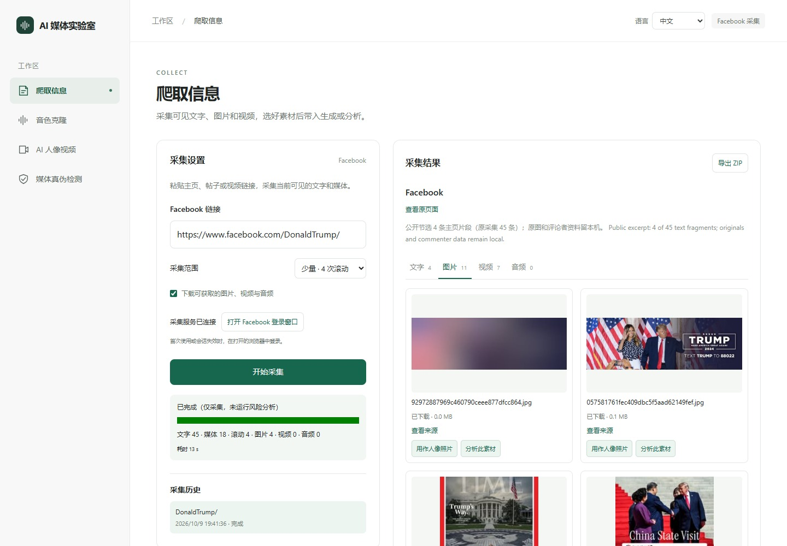
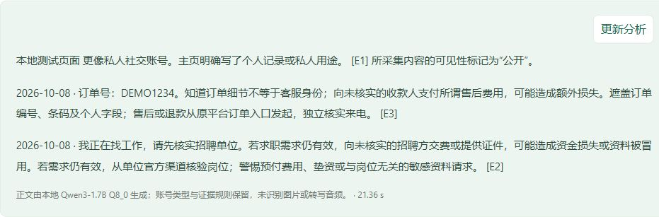
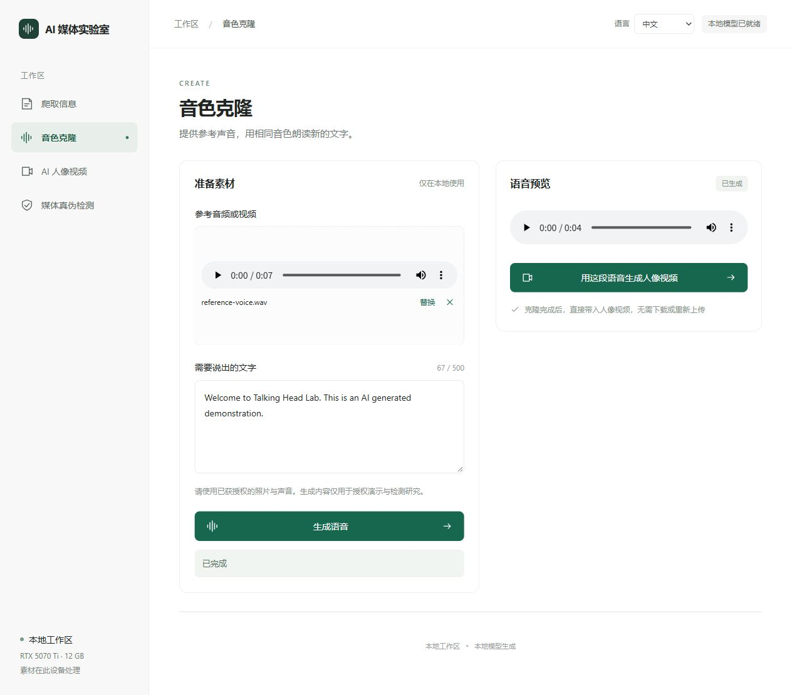
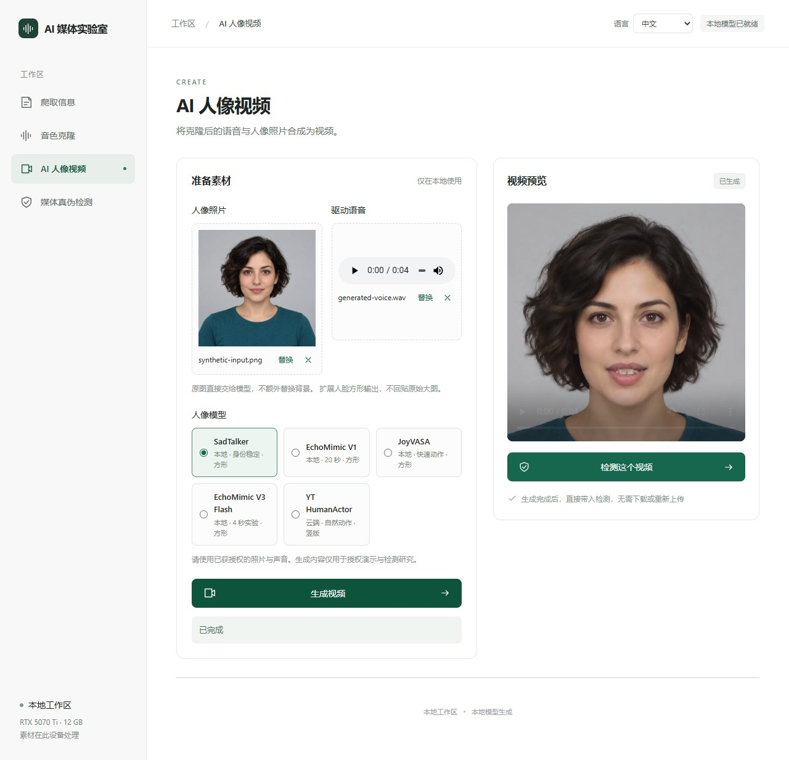
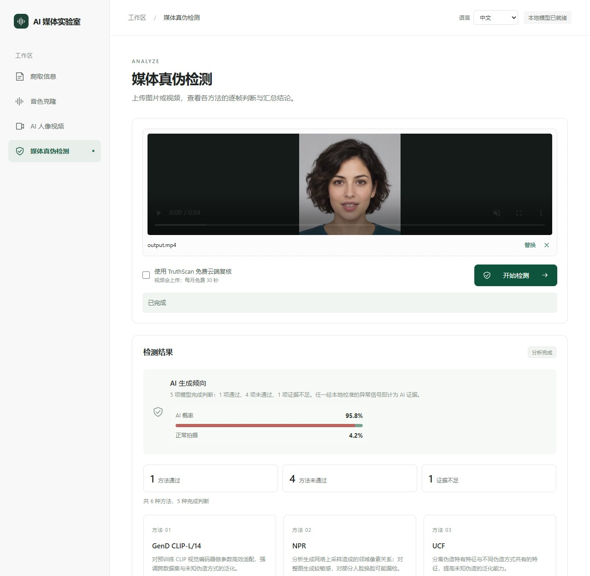

# Talking Head Lab

**采集可见信息，生成声音与人像视频，再查看真伪检测证据。**

[简体中文](README.md) · [English](README.en.md)

一个以 Windows + WSL2 为维护环境的 AI 媒体工作台，包含 Facebook 采集与账号防范分析、音色克隆、照片驱动视频和媒体真伪检测。四个模块可以独立使用，也可以通过资源 ID 接续完成流程。

## 功能与效果展示

### 先看一段真实生成结果

<table>
  <tr><th>① 合成输入原图</th><th>② 原图直接生成视频</th></tr>
  <tr>
    <td></td>
    <td></td>
  </tr>
</table>

人像输入由 imagegen 创建，参考声音由 Windows 系统语音合成；声音使用现有 Chatterbox 生成，视频将原图直接交给 SadTalker；不增加背景更换步骤。GIF 来自同一份 **512×512、4.736 秒**视频。台词为：

> Welcome to Talking Head Lab. This is an AI generated demonstration.

[播放或下载带声音的 MP4](docs/showcase/sadtalker-original-demo.mp4) · [参考合成声音 WAV](docs/showcase/reference-voice.wav) · [Chatterbox 输出 WAV](docs/showcase/generated-voice.wav) · [素材来源与实跑记录](docs/showcase/PROVENANCE.md)

生成演示使用虚构人物与合成声音；声音、视频和检测均为真实任务。Facebook 展示使用下方 **Donald J. Trump 官方页面的真实采集结果**；账号防范正文的排版示例仍来自已有合成测试，没有执行新的账号分析推理。

### 四个模块分别做什么

| 模块 | 输入什么 | 得到什么 | 可以接着做什么 |
|---|---|---|---|
| **爬取信息与账号分析** | 可访问的 Facebook 主页、帖子或视频链接；手动登录后的会话 | 可见原文、来源链接、可下载媒体、ZIP，以及有文字依据的防范提醒 | 选择已下载的照片、声音或视频，带入生成或检测 |
| **音色克隆** | 清晰的参考音频或含音轨的视频，加上需要朗读的文字 | Chatterbox 生成的语音，可试听与下载 | 一键带入人像视频，复用资源 ID |
| **AI 人像视频** | 正脸照片和驱动语音 | 原图驱动的视频 | 预览、下载，再直接检测生成视频 |
| **媒体真伪检测** | 图片、上传的视频，或工作台刚生成的视频 | 多方法结论、评分、采样帧与秒数、通过/未通过/证据不足汇总 | 对照具体时段和方法解释检查证据 |

### 1. 采集与账号防范分析



**真实账号示例：**[Donald J. Trump 的 Facebook 页面](https://www.facebook.com/DonaldTrump/)。2026-10-09 06:41 UTC 使用项目现有采集器完成 4 次滚动，耗时 **13.0 秒**；得到 **45 条可见文字片段、11 个图片条目、7 个视频条目**，其中 **4 张图片已下载，视频和音频下载数均为 0**。文字片段包含主页字段、界面文字和部分评论，并不等于 45 篇帖子。



本页只公开 4 条主页原文节选和界面截图，评论者资料、原始图片文件与登录会话留在本机。7 个视频条目只有来源链接，其中包含同一 Reel 的不同链接；本次没有提取到发布日期，记录为缺失。截图由真实工作台与采集 API 加载已完成任务的公开节选，截图时没有再次采集或推理。[查看完整示例说明与视频链接界面](docs/showcase/facebook-trump/EXAMPLE.md) · [来源、时间、数量及文件 SHA256](docs/showcase/facebook-trump/collection-summary.json)。

页面简介与用途字段显示其为官方政治公共页面，因此本例**只采集，不进行个人风险分析**。示例直接调用唯一现有采集器并跳过账号分析；这是本例的执行边界，不代表下面的自动门控已经发布。

输入链接后，选择 4、8 或 20 次滚动，预览可见文字、图片、视频和音频，再导出 ZIP。遇到登录或验证页面会提示用户手动操作。账号警示面向已判定的私人账号，沿用可追溯的文字证据，由规则和本地 Qwen 整理原文中的关系与联系方式，以及对应的核验动作；不识别人脸、不转写声音，也不计算个人受骗概率。

**当前版本边界：**最新要求是先区分私人、企业/机构与无法确定，只分析私人。新门控与通用化实现目前仅在原工作区，尚未同步到本发布版本或运行服务；当前GitHub版本没有完成自动门控，使用前应人工确认私人用途，企业/机构和无法确定应跳过风险分析。通用正文仍有重复、引用失真和警示遗漏的已知未通过项。



引用保留原语言，切换中文/English 会切换分析正文和 ZIP 内的文字报告。重大防范矛盾的证据对、时间传递与影响解释仍有[待完成规格](docs/specs/account-warning-conflicts.md)，现有界面展示不代表该新规格已经全部实现。

### 2. 参考声音 → 新台词



支持音频和含音轨的视频作为参考，视频会先提取音轨；参考最多使用前 20 秒，文字最多 500 字符。生成后可以试听、下载，或点击“用这段语音生成人像视频”。本例系统参考声音约 7.3 秒，项目实际输出为 **4.68 秒**，生成任务报告用时 **38.1 秒**；这些时间仅对应本演示环境。

### 3. 照片与声音 → 人像视频



原图和驱动音频直接交给所选视频模型，不额外选择环境、生成背景或拼接肖像。模型自身必需的裁剪、缩放、对齐与原生构图沿用既有能力；账号文本 Qwen 独立保留。

| 模型选项 | 运行位置 | 当前接口的时长限制 | 输出方式 |
|---|---|---|---|
| SadTalker | 本地 GPU | 60 秒以内 | 扩展脸部区域，方形视频 |
| EchoMimic V1 | 本地 GPU | 20 秒以内 | 原生方形视频 |
| JoyVASA | 本地 GPU | 60 秒以内 | 原生方形视频 |
| EchoMimic V3 Flash | 本地 GPU | 4 秒以内的实验模式 | 原生短视频 |
| YT HumanActor | 腾讯 TokenHub + COS | 2–60 秒 | 竖版肖像，保留云端输出画幅 |

本页新演示实跑的是 **SadTalker**，任务报告用时 **61.9 秒**，没有背景准备前置。其他选项按配置显示可用状态；本轮未重新生成这些模型的样片。腾讯接入的准确模型 ID 为 `yt-video-humanactor`，配置说明见部署部分。

### 4. 视频 → 多方法检测证据



检测包含 GenD、NPR、UCF、RECCE、F3-Net 和照片驱动时序静态性；频谱、光流及连续性指标另作辅助取证。视频域中 NPR 展示“证据不足”并退出投票。每种方法提供自己的解释与适用的高/低评分时段。

本演示同一视频得到 **AI 生成倾向**，界面汇总评分 **95.8%**，结果为 **1 项通过、4 项未通过、1 项证据不足**，任务报告用时 **24.1 秒**。[原始 JSON 报告](docs/showcase/detection-original-report.json)保留实际数值。这些评分来自当前模型与本地阈值，适用范围是该样例；未知视频应结合多方法分歧、采样和来源判断。

## 部署

### 环境与两种启动方式

| 组件 | 所需环境 |
|---|---|
| 仅浏览界面 | Node.js **>=22.13.0**，以[前端 package.json](facebook-scam/video-forensics-web/package.json)为准 |
| Windows 采集 | Python 3.10+、Playwright；已有 Chrome/Edge 可复用，否则安装 Chromium |
| 完整本地推理 | Windows + WSL2 / Ubuntu 22.04，NVIDIA GPU，模型独立环境及权重 |
| 维护目录 | WSL 模型 `/opt/media-models`；后端运行代码 `/opt/media-app/local-media` |
| 可选云端 | TokenHub + COS；TruthScan 配置独立启用 |

本轮实际验证了发布 checkout 的 `npm ci`、前端构建和上述合成素材任务。全新机器的完整 GPU 安装未在本轮重跑；当前安装脚本包含固定路径、Python 3.10 目录与 CUDA 编译参数，安装前需要按设备核对。

### A. 先运行界面预览

在一个新目录克隆并启动前端：

```powershell
git clone https://github.com/yxriam/talking-head-lab.git
Set-Location talking-head-lab/facebook-scam/video-forensics-web
npm ci
npm run dev -- --host 127.0.0.1 --port 3100
```

打开 **http://localhost:3100/studio**。没有后端与模型时，可以查看四个界面，生成和检测会显示未就绪状态。需要本地模型功能时继续下面的配置。

### B. 配置完整 Windows + WSL 环境

**1. 核对路径。**现有 Linux 安装/同步脚本仍引用 `D:/project/cv` 与 `D:/project/NZ/cv`。全新机器可以采用以下目录布局；已有 checkout 换路径时，先调整 `prepare-linux.ps1`、`run-linux.ps1`、`activate-api.sh`、`sync-runtime.sh` 和安装脚本中的对应路径。维护者当前发布 checkout 位于 `D:/project/facebook/talking-head-lab`，更新运行代码时同样要核对实际源目录。

<details>
<summary>全新机器的固定路径示例（仅在目录尚不存在时使用）</summary>

```powershell
New-Item -ItemType Directory -Path D:\project\NZ -Force
git clone https://github.com/yxriam/talking-head-lab.git D:\project\NZ\cv
New-Item -ItemType Junction -Path D:\project\cv -Target D:\project\NZ\cv
Set-Location D:\project\cv
```

</details>

**2. 安装 Windows 采集依赖与前端依赖。**在项目根目录执行：

```powershell
py -3 -m venv local-media\.venv
local-media\.venv\Scripts\python.exe -m pip install -r local-media\requirements-crawl.txt
local-media\.venv\Scripts\python.exe -m playwright install chromium
Set-Location facebook-scam/video-forensics-web
npm ci
npm run build
Set-Location ../..
```

低内存或正在进行模型任务时，先结束大任务；本轮构建用 `$env:RAYON_NUM_THREADS='2'` 限制原生构建线程后通过。浏览器使用默认检测到的 Chrome/Edge，或 Playwright Chromium。

**3. 准备 WSL 和模型。**安装 Ubuntu、完成其首次用户设置，然后检查 `nvidia-smi`：

```powershell
wsl --install -d Ubuntu-22.04
wsl -d Ubuntu-22.04 -- nvidia-smi
powershell -ExecutionPolicy Bypass -File .\local-media\prepare-linux.ps1
```

下面是已有安装脚本的依赖顺序。模型体积大，逐个执行并核对各步日志。`install-scene-llm.sh` 中的 CUDA 架构 `120` 等编译参数需与自己的设备匹配。

<details>
<summary>本地模型及后端服务安装顺序</summary>

```powershell
powershell -ExecutionPolicy Bypass -File .\local-media\run-linux.ps1 -Task setup-models
powershell -ExecutionPolicy Bypass -File .\local-media\run-linux.ps1 -Task install-generators
powershell -ExecutionPolicy Bypass -File .\local-media\run-linux.ps1 -Task install-echomimic
powershell -ExecutionPolicy Bypass -File .\local-media\run-linux.ps1 -Task install-detectors
powershell -ExecutionPolicy Bypass -File .\local-media\run-linux.ps1 -Task install-npr
powershell -ExecutionPolicy Bypass -File .\local-media\run-linux.ps1 -Task install-gend
wsl -d Ubuntu-22.04 -u root -- bash /mnt/d/project/cv/local-media/install-scene-llm.sh
wsl -d Ubuntu-22.04 -u root -- mkdir -p /opt/media-app/local-media
wsl -d Ubuntu-22.04 -u root -- cp /mnt/d/project/cv/local-media/patch_echomimic_v3_memory.py /opt/media-app/local-media/
wsl -d Ubuntu-22.04 -u root -- bash /mnt/d/project/cv/local-media/install-sota-generators.sh
powershell -ExecutionPolicy Bypass -File .\local-media\run-linux.ps1 -Task activate-api
```

当前 `sync-runtime.sh` 会检查所列模型目录，因此完整启动路径需要先准备这些目录。权重就绪、模型语义验收和服务验证分别记录；完整过程、日志、网络修复与停止方法见[安装和启动详解](网站启动说明.md)。

</details>

**4. 日常启动与健康检查。**模型环境和服务已准备后，在项目根目录运行：

```powershell
powershell -ExecutionPolicy Bypass -File .\local-media\start-local.ps1
curl.exe http://localhost:3100/api/health
curl.exe http://127.0.0.1:8003/crawl/health
```

模型健康地址应返回 `status: ok`，各能力的 `ready` 表示当前配置状态。页面在 `http://localhost:3100/studio`；采集由 Windows 8003 提供，推理由 WSL 8002 提供，前端代理这两条链路。关闭浏览器会保留后台服务，完整停止方式见[启动详解](网站启动说明.md#3-怎么正确停止)。

### 可选：腾讯人像生成与云端复核

腾讯 TokenHub 使用 `yt-video-humanactor`，API Key 和 COS 的 SecretId、SecretKey、地域、存储桶写到 Ubuntu 的 `/etc/media-app/tokenhub.env`，通过现有 systemd 配置脚本加载。图片和音频上传 COS，使用短时签名 `image_url` / `audio_url` 提交，轮询完成后下载视频，程序尝试清理临时对象。

TruthScan 使用 `/etc/media-app/truthscan.env`。勾选云端复核会上传视频并使用账户额度；本轮演示已取消该勾选，仅执行本地方法。详细配置见[后端说明](local-media/README.md#tokenhub-人像驱动)与[云端复核说明](local-media/README.md#truthscan-免费云端复核)。真实配置、会话与密钥保留本机。

## 使用

1. **采集**：打开“爬取信息”→手动登录→粘贴可访问链接→开始采集→预览原文和素材→先确认用途，仅私人账号检查账号提醒，其他材料跳过风险分析→导出 ZIP。
2. **声音**：上传清晰、已授权的参考声音→输入台词→生成并试听→点击“用这段语音生成人像视频”。
3. **视频**：选择清晰正脸→选择驱动声音和模型→生成→预览/下载→点击“检测这个视频”。
4. **检测**：复用刚生成的视频或上传独立图片/视频→选择是否进行外部复核→查看汇总、方法解释和对应帧/秒数。

可以从任何模块开始。语音/视频交接复用资源 ID，不需要反复下载上传；直接上传的驱动音频只用于驱动，不自动转写，也不触发背景流程。当前 API 单文件上限 500 MB，GPU任务顺序执行。上传和生成文件保存在运行服务的 `data/`，由使用者按任务清理。

## 项目结构与代码分布

```text
talking-head-lab/
├─ README.md / README.en.md                 中文 / 英文入口
├─ facebook-scam/
│  ├─ crawler/facebook.py                   唯一在线采集实现
│  └─ video-forensics-web/
│     ├─ app/studio/                        四模块页面、样式、前端 API
│     ├─ build/sites-vite-plugin.ts         必需的 Vite 源码插件
│     └─ tests/                             前端既有检查
├─ local-media/
│  ├─ crawl_server.py / server.py            Windows采集 / WSL媒体 API
│  ├─ account_risk.py / account_story.py      文字证据规则与正文整理
│  ├─ account_llm.py / local_account_model.py 本地模型桥接与推理
│  ├─ generate.py / video_profiles.py        生成子进程、构图与时长策略
│  ├─ local_scene.py / prepare_scene.py      历史背景实验，未进入当前视频链
│  ├─ detect.py                             媒体检测和辅助取证
│  ├─ tokenhub.py / truthscan.py             可选外部接口
│  ├─ detector-runtime/                     检测安装注册源码
│  └─ test_*.py / *.sh / *.ps1               测试、安装、启动与同步
├─ docs/showcase/                           本轮公开合成演示及来源说明
├─ docs/specs/ / docs/change-records/        契约、变化、验证与回退
└─ AGENTS.md / CLAUDE.md / .cursor/rules/    共享协作规范与工具入口
```

根目录其他脚本与研究文档保留历史来源，当前工作台从 `app/studio/` 维护。模型权重、虚拟环境、私人人物媒体、采集数据与真实凭据不在源码仓库；此处明确标注的合成展示资源用于阅读 README。

## 二次开发

### 修改什么，去哪里

| 要做的改动 | 入口与检查范围 |
|---|---|
| 改界面、布局或增加前端交互 | `Studio.tsx`、`CrawlPanel.tsx`、`studio.css`、`crawl.css`、`api.ts`；前端构建与行为检查 |
| 改采集字段 | `crawler/facebook.py`→`crawl_server.py`→账号规则/桥接/输出；保留来源与时间，运行采集测试 |
| 改账号提示或正文 | `account_risk.py`→`account_story.py`→`account_llm.py`→`server.py /account-analysis`→`local_account_model.py`；程序与真实模型分别验收 |
| 增加视频模型 | `video_profiles.py`、`generate.py`、`server.py` 能力/队列、前端模型选项；明确构图、时长、失败行为 |
| 改检测方法 | `detect.py` 与报告字段、前端显示；保留真实阈值、采样时段和证据不足状态 |

### 验证、同步与回退

先读 [AGENTS.md](AGENTS.md) 和 [PROJECT.md](PROJECT.md)，按[维护流程](docs/WORKFLOW.md)冻结任务规格、审实际 diff、运行直接相关检查，再做一个任务一个提交。

```powershell
local-media\.venv\Scripts\python.exe -m unittest discover -s local-media -p test_account_llm.py -v
local-media\.venv\Scripts\python.exe -m unittest discover -s local-media -p test_server.py -v
Set-Location facebook-scam/video-forensics-web
npm run build
```

按改动范围补充账号规则/正文、采集或模型相关检查。提示词修改需要冻结用例和真实模型输出，程序测试不能替代语义验收。

后端部署沿用 `sync-runtime.sh` 的 SHA256 同步，再重启并验证运行服务；脚本中的源路径需指向实际维护 checkout。源码提交、GitHub推送、运行部署是不同阶段。

```powershell
wsl -d Ubuntu-22.04 -u root -- bash /mnt/d/project/cv/local-media/sync-runtime.sh
wsl -d Ubuntu-22.04 -u root -- systemctl restart local-media.service
curl.exe http://localhost:3100/api/health
```

已共享任务用 `git revert <实际提交号>`，验证后正常 `git push origin main`。本轮的真实输入、耗时、失败修复、验证和回退见[展示变更记录](docs/change-records/2026-10-09-readme-showcase/记录.md)。
