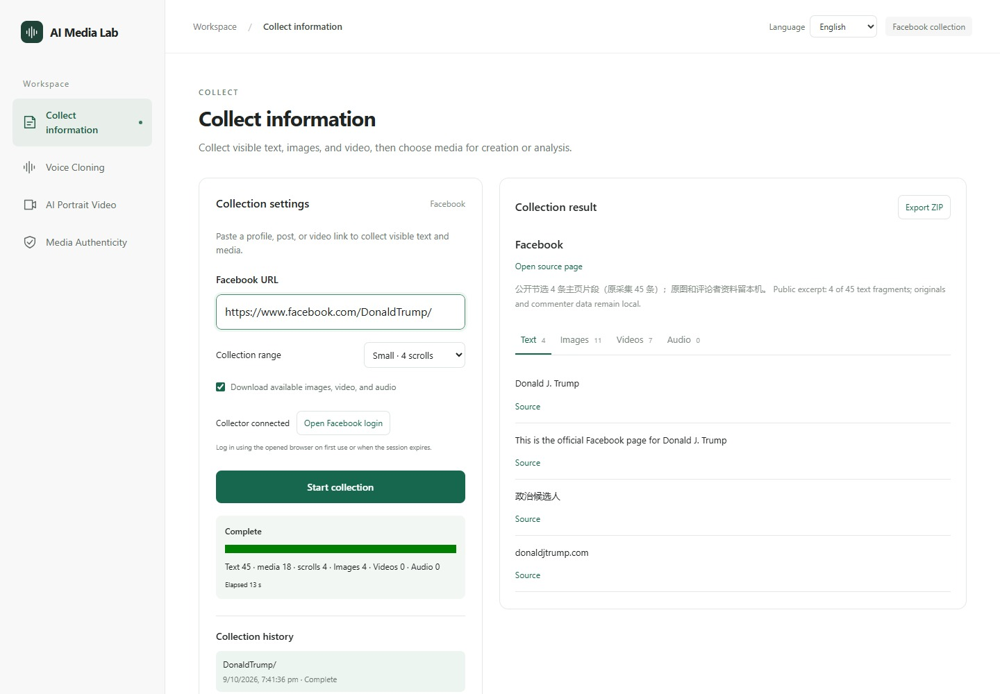
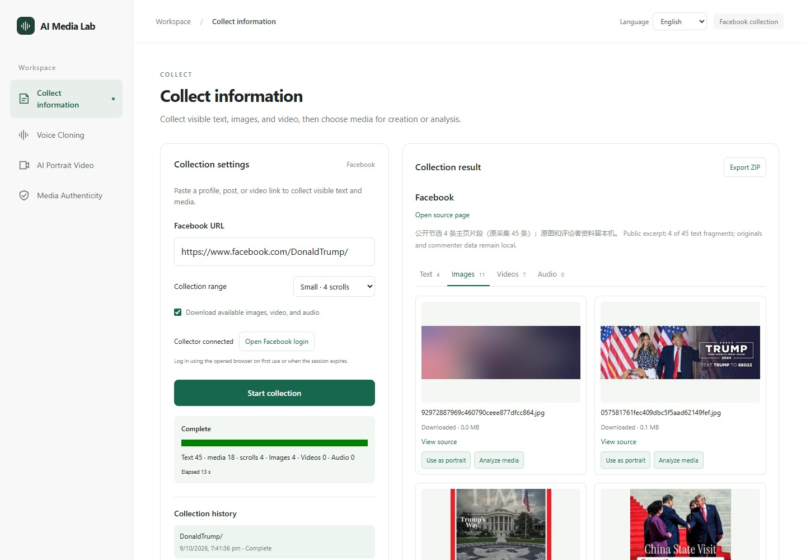
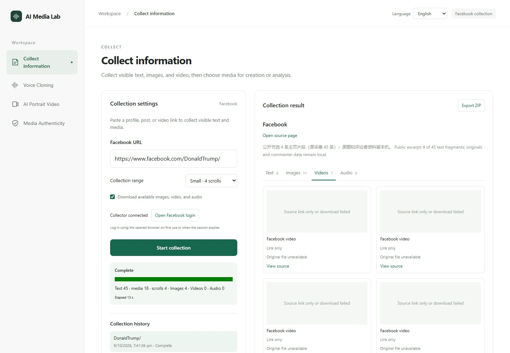

# Live Facebook collection example: Donald J. Trump

[中文](EXAMPLE.md) · [English](EXAMPLE.en.md) · [Back to project showcase](../../../README.en.md#features-and-results)

Target: [https://www.facebook.com/DonaldTrump/](https://www.facebook.com/DonaldTrump/). The user requested this real account as the collection example. The run called the existing `facebook-scam/crawler/facebook.py` with the saved local session. It introduced no second crawler and called neither a classification model nor a personal-risk model.

## What the run obtained

| Item | Actual result |
|---|---|
| Collection time | 2026-10-09 06:41:36–06:41:49 UTC (19:41, Pacific/Auckland) |
| Range | 4 scrolls; content visible while scrolling |
| Text | 45 fragments, including profile fields, interface text, post areas and some comments; not 45 posts |
| Images | 11 entries, 4 files saved; includes a page placeholder and thumbnails, not exclusively full-resolution originals |
| Video | 7 entries, source links only; different links to the same Reel are included, not 7 distinct videos |
| Audio | None obtained |
| Time | 13.0 seconds for the task, 12.2 seconds inside the collector; specific to this run |
| Publication dates | Not extracted; original date=null values remain missing. Collection time is not a posting date |

The [public JSON summary](collection-summary.json) retains sources, timestamps, selected text, media status and SHA256 values for downloaded files. Raw data remains in the ignored local `local-media/crawl-data/<job ID>/` directory. Full posts/comments, commenter names, tracking parameters, signed CDN URLs, browser sessions and standalone original images were not published.

## How the interface uses the result



The inputs show the actual target and 4-scroll setting. The task summary retains the original counts; the result panel displays only 4 profile excerpts with their sources. The real workbench loads a public excerpt of this completed run. Screenshots triggered no new collection or model tasks.



The image tab displays download status and sources. The workbench can pass downloaded media to other modules; this example only shows the controls. It did not use Trump's photographs or voice for generation, cloning or detection.



This page exposed no video file that the collector could save during the run, so the interface displays “Link only.” Results can differ with date, session and page layout. Visible-page collection does not guarantee all history, full text, posting dates, individual post links or every original media file.

## Reproduce the collection-only workflow locally

Follow the [deployment and usage instructions](../../../README.en.md#deployment) to configure Windows collection dependencies and start the collector. On first use, choose “Open Facebook login” in the workbench and log in manually. Then run from the project root:

```powershell
local-media\.venv\Scripts\python.exe docs\change-records\2026-10-09-facebook-trump-showcase\collect-example.py
```

The runner fixes this URL, 4 scrolls, and caps of 4 images/1 video. It directly calls the existing collector, writes local job/receipt files, stops at login or verification, and preserves the committed acceptance evidence. Open the new history record in the running collector workbench after completion. It does not invoke the account-analysis module.

The visible introduction and purpose field support the observation that this is an official political public page, so this example emits no personal-risk warnings. Automatic personal-account gating in the published version still requires separate acceptance. This example explicitly omits the old API's automatic account analysis by calling the collector directly; it is not evidence that gating has been deployed.

## Evidence and presentation scope

Job ID: `dc0b2ae09f004833b104c6f4c9116b73`. The public JSON contains collector/file SHA256 values and missing-field notes. Run and capture evidence appears in the [change record](../../change-records/2026-10-09-facebook-trump-showcase/记录.md).

Screenshots use the existing Playwright/Edge with the user's permission, against the real localhost workbench and published collector API. The API reads the public excerpt from isolated local data; capture requests are GET only. No business source was edited, tools installed, collection repeated, new models run or cloud uploads performed. This demonstrates collection functionality and does not imply endorsement by the page owner.
