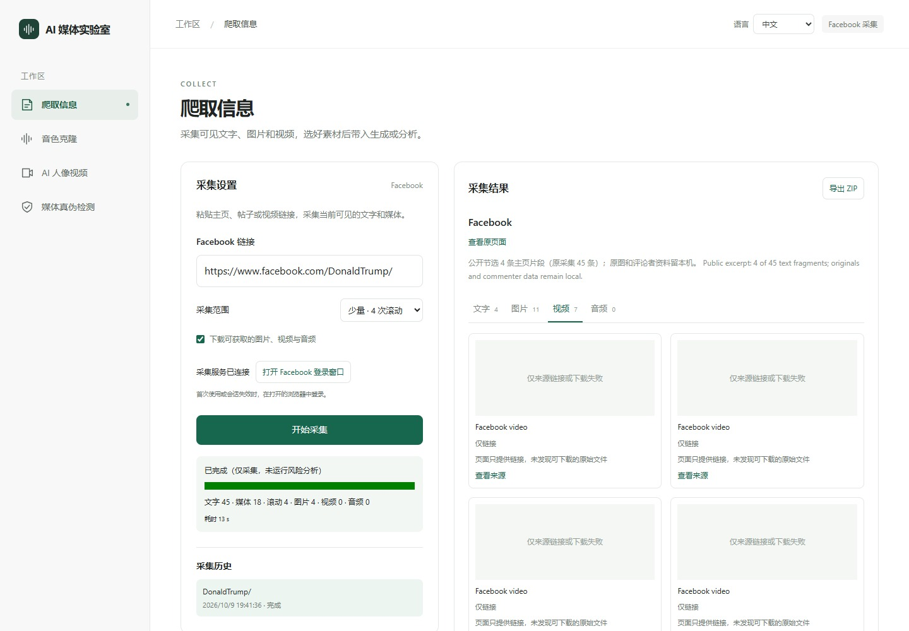

# Facebook 实采示例：Donald J. Trump

[中文](EXAMPLE.md) · [English](EXAMPLE.en.md) · [返回首页](../../../README.md#效果展示)

目标：[https://www.facebook.com/DonaldTrump/](https://www.facebook.com/DonaldTrump/)。用户指定以这个真实账号展示 Facebook 采集。只调用项目既有 `collector/facebook.py`，使用本机已保存的会话；未另建爬虫，也未运行账号分类模型或个人风险模型。

## 取得了什么

| 项目 | 本次实际结果 |
|---|---|
| 采集时间 | 2026-10-09 06:41:36–06:41:49 UTC（Pacific/Auckland 19:41） |
| 滚动范围 | 4 次；只收集滚动过程中可见的内容 |
| 文字 | 45 条片段，包含主页字段、界面文字、帖子区域与部分评论；不是 45 篇帖子 |
| 图片 | 11 个条目，4 个文件保存成功；包含页面占位图与缩略图，不能统称高清原图 |
| 视频 | 7 个条目，均仅来源链接；包含同一 Reel 的不同链接，不能统称 7 个独立视频 |
| 音频 | 未取得 |
| 耗时 | 任务 13.0 秒，采集函数 12.2 秒；仅代表本次环境 |
| 发布日期 | 本次提取器未取得，原记录 date=null；不将采集时间冒充发帖时间 |

[公开概览 JSON](collection-summary.json)保留链接、时间、片段节选、媒体状态与已下载文件的 SHA256。原始数据留在本机已忽略的 `collector/crawl-data/<任务 ID>/`，没有发布完整帖子/评论、评论者姓名、追踪参数、CDN 签名、登录状态或独立原图文件。

## 界面怎样使用这些结果


输入栏显示真实目标与 4 次滚动设置；左侧任务汇总显示原采集数量，右侧只展示 4 条主页节选，每条保留来源。工作台真实读取本次完成任务的公开节选，没有为截图再次发起采集或模型任务。


图片页展示下载状态和来源。工作台支持把已下载素材带入后续模块；本例仅展示按钮，没有使用特朗普的照片或声音进行生成、克隆或检测。



这次页面没有提供采集器能够保存的视频文件，界面如实显示“仅链接”。不同日期、登录状态与页面布局的结果可能不同；可见页面采集不保证取得全部历史、全部原文、发布日期、帖子独立链接或所有原始媒体。

## 在本机复现只采集的流程

先按[部署指南](../../guides/SETUP.md)配置 Windows 采集依赖、启动采集服务，首次使用在工作台点击“打开 Facebook 登录窗口”并手工登录。然后从项目根目录执行：

```powershell
collector\.venv\Scripts\python.exe docs\change-records\2026-10-09-facebook-trump-showcase\collect-example.py
```

运行器固定本链接与 4 次滚动、最多 4 张图片/1 段视频，直接调用现有采集器；只写本机采集任务与回执，遇到登录/验证就停止，不覆盖已提交的本次验收证据。完成后可在已启动的采集工作台打开新历史记录。它不调用账号分析模块。

该公共页面的实际简介与用途字段支持“官方政治公共页面”的观察，所以本例不输出个人风险警示。本示例采集时直接调用采集器，没有经过账号分析；现在的工作台会先分类，这类公共页面只显示分类说明。

## 证据与展示边界

任务 ID `dc0b2ae09f004833b104c6f4c9116b73`。原采集器 SHA256、下载文件摘要和缺失字段见公开 JSON；运行回执/截图方法见[变更记录](../../change-records/2026-10-09-facebook-trump-showcase/记录.md)。

使用用户已允许的现有 Playwright/Edge，对 localhost 的真实工作台和现有发布版采集 API 截图；API 从隔离本地数据目录读取公开节选，截图请求只有 GET。没有修改业务源码、安装工具、重新采集、运行新模型或向云端上传。本示例展示采集功能，不代表页面方认可本项目。
